# Jenkins CI/CD Pipeline for Flask Application on AWS EC2

**Author:** Sairam Raavi

---

## Project Objective

The objective of this project was to automate the Continuous Integration and Continuous
Deployment (CI/CD) process for a Flask web application using Jenkins. It demonstrates how
a source code change pushed to GitHub automatically triggers a Jenkins pipeline, runs build
and test stages, deploys the application to a remote EC2 instance over SSH, and verifies the
deployment with a health check and an email notification — all without any manual steps.

---

## Architecture

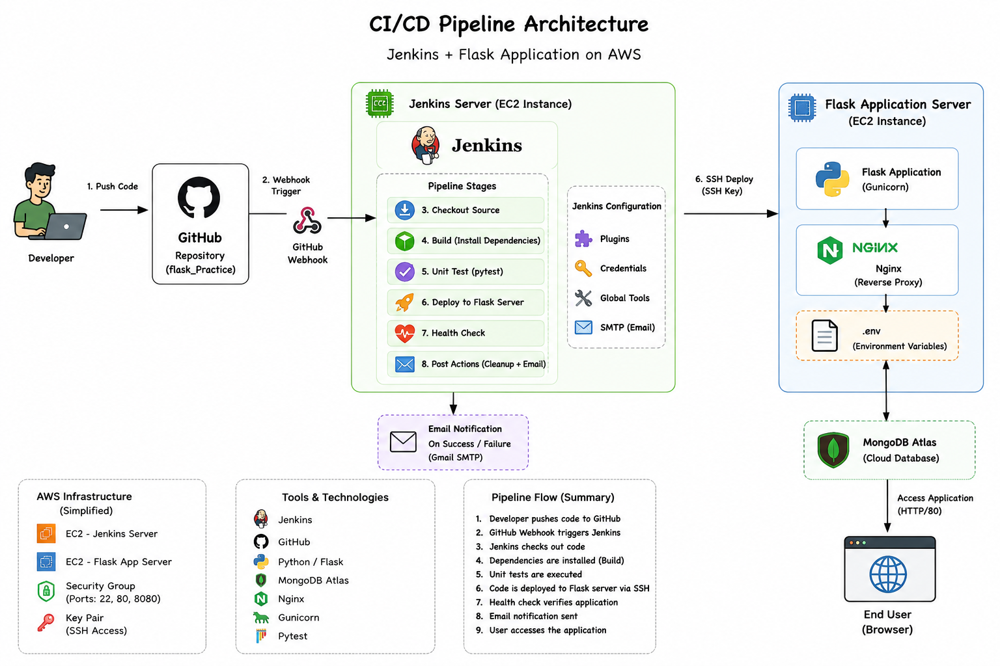

**Flow summary:**

1. Developer pushes code to GitHub
2. GitHub Webhook triggers Jenkins
3. Jenkins checks out the code
4. Dependencies are installed (Build stage)
5. Unit tests are executed (pytest)
6. Code is deployed to the Flask EC2 server via SSH
7. A health check verifies the application is up
8. An email notification is sent (success/failure)
9. End users access the app through Nginx → Gunicorn → Flask

**Components:**

| Layer | Technology |
|---|---|
| Source control | GitHub (`flask_Practice` repo) |
| CI/CD orchestration | Jenkins (declarative pipeline) |
| Jenkins host | AWS EC2 (t2.micro, Ubuntu) |
| Application host | AWS EC2 (t2.micro, Ubuntu) |
| App server | Gunicorn |
| Reverse proxy | Nginx |
| Database | MongoDB Atlas |
| Notifications | Gmail SMTP (Email Extension plugin) |

---

## Repository Layout

```
flask_Practice/
├── app.py
├── requirements.txt
├── start_flask.sh
├── Jenkinsfile
├── test_app.py
└── templates/
    ├── base.html
    ├── index.html
    ├── add_student.html
    └── update_student.html

launch-templates/
├── jenkins-userdata.sh
└── flask-userdata.sh

screenshots/
└── (pipeline runs, AWS console, GitHub config, etc.)
```

---

## AWS Infrastructure

Two separate EC2 instances were provisioned to keep the Jenkins controller and the
application runtime isolated:

| Instance | Purpose | Type | Ports opened |
|---|---|---|---|
| `jenkins-practice` | Jenkins controller | t2.micro | 22, 8080 |
| `Flask-app` | Flask application host | t2.micro | 22, 80 |

Both instances were originally created manually, then re-provisioned using **AWS Launch
Templates** with `user-data` scripts (`launch-templates/jenkins-userdata.sh` and
`launch-templates/flask-userdata.sh`) so that a fresh Jenkins or Flask server can be spun
up automatically without repeating manual setup.

### `jenkins-userdata.sh` automates:
- System update
- Installing OpenJDK 21
- Adding the Jenkins APT repository and installing Jenkins
- Enabling and starting the Jenkins service
- Writing the initial admin password and access URL to `/home/ubuntu/jenkins-info.txt`

```bash 
#!/bin/bash
set -e

exec > >(tee /var/log/user-data.log)
exec 2>&1

echo "Starting Jenkins Installation..."

apt update -y
apt upgrade -y

apt install -y fontconfig openjdk-21-jre curl gnupg

systemctl restart networkd-dispatcher.service || true
systemctl restart systemd-logind.service || true
systemctl restart unattended-upgrades.service || true

curl -fsSL https://pkg.jenkins.io/debian-stable/jenkins.io-2026.key | \
tee /usr/share/keyrings/jenkins-keyring.asc >/dev/null

echo "deb [signed-by=/usr/share/keyrings/jenkins-keyring.asc] https://pkg.jenkins.io/debian-stable binary/" | \
tee /etc/apt/sources.list.d/jenkins.list >/dev/null

apt update -y

apt install -y jenkins

systemctl enable jenkins
systemctl start jenkins

if command -v ufw >/dev/null 2>&1; then
    ufw allow 8080 || true
    ufw --force reload || true
fi

echo "======================================================" >/home/ubuntu/jenkins-info.txt
echo "Jenkins Installed Successfully" >>/home/ubuntu/jenkins-info.txt
echo "" >>/home/ubuntu/jenkins-info.txt
echo "Admin Password:" >>/home/ubuntu/jenkins-info.txt
cat /var/lib/jenkins/secrets/initialAdminPassword >>/home/ubuntu/jenkins-info.txt
echo "" >>/home/ubuntu/jenkins-info.txt

PUBLIC_IP=$(curl -s http://checkip.amazonaws.com)

echo "Access Jenkins at: http://${PUBLIC_IP}:8080" >>/home/ubuntu/jenkins-info.txt

chown ubuntu:ubuntu /home/ubuntu/jenkins-info.txt

echo "Jenkins installation completed."
```

### `flask-userdata.sh` automates:
- Installing Python, pip, Git, Nginx
- Cloning the `flask_Practice` repository
- Creating a virtual environment and installing `requirements.txt`
- Creating the `.env` file with the MongoDB URI
- Installing Gunicorn and creating a `flask-app` systemd service
- Configuring Nginx as a reverse proxy to Gunicorn on port 5000

```bash
#!/bin/bash
set -euxo pipefail

exec > >(tee /var/log/flask-userdata.log | logger -t user-data -s 2>/dev/console) 2>&1

echo "========== Flask Server Provisioning Started =========="

##############################################
# Update System
##############################################

apt-get update -y
apt-get upgrade -y

##############################################
# Install Required Packages
##############################################

apt-get install -y \
git \
python3 \
python3-pip \
python3-venv \
python3-dev \
build-essential \
nginx \
curl

##############################################
# Create Application User (Optional)
##############################################

id ubuntu || useradd -m ubuntu

##############################################
# Application Directory
##############################################

APP_DIR="/home/ubuntu/flask_Practice"

##############################################
# Clone Repository
##############################################

if [ ! -d "$APP_DIR" ]; then
    git clone https://github.com/sairamraavi/flask_Practice.git "$APP_DIR"
fi

cd "$APP_DIR"

##############################################
# Create Virtual Environment
##############################################

python3 -m venv venv

source venv/bin/activate

pip install --upgrade pip

pip install -r requirements.txt

##############################################
# Create .env File
##############################################

cat > .env <<'EOF'
MONGO_URI="mongodb+srv://<userid>:<password>@<connection_url.mongodb.net>/flask-app"
EOF

chown ubuntu:ubuntu .env
chmod 600 .env

##############################################
# Install Gunicorn
##############################################

pip install gunicorn

##############################################
# Create systemd Service
##############################################

cat > /etc/systemd/system/flask-app.service <<EOF
[Unit]
Description=Flask Application
After=network.target

[Service]
User=ubuntu
Group=ubuntu
WorkingDirectory=$APP_DIR
Environment="PATH=$APP_DIR/venv/bin"
ExecStart=$APP_DIR/venv/bin/gunicorn --bind 0.0.0.0:5000 app:app
Restart=always

[Install]
WantedBy=multi-user.target
EOF

##############################################
# Configure Nginx Reverse Proxy
##############################################

cat > /etc/nginx/sites-available/flask-app <<EOF
server {
    listen 80;
    server_name _;

    location / {
        proxy_pass http://127.0.0.1:5000;
        proxy_set_header Host \$host;
        proxy_set_header X-Real-IP \$remote_addr;
        proxy_set_header X-Forwarded-For \$proxy_add_x_forwarded_for;
        proxy_set_header X-Forwarded-Proto \$scheme;
    }
}
EOF

rm -f /etc/nginx/sites-enabled/default
ln -sf /etc/nginx/sites-available/flask-app /etc/nginx/sites-enabled/

nginx -t

systemctl restart nginx
systemctl enable nginx

##############################################
# Start Flask Application
##############################################

systemctl daemon-reload
systemctl enable flask-app
systemctl restart flask-app

##############################################
# Permissions
##############################################

chown -R ubuntu:ubuntu "$APP_DIR"

##############################################
# Installation Summary
##############################################

PUBLIC_IP=$(curl -s http://checkip.amazonaws.com)

cat <<EOF >/home/ubuntu/flask-server-info.txt
==========================================
Flask Server Installed Successfully
==========================================

Repository:
https://github.com/sairamraavi/flask_Practice

Application Directory:
$APP_DIR

Flask URL:
http://$PUBLIC_IP

Gunicorn:
systemctl status flask-app

Nginx:
systemctl status nginx

Logs:
journalctl -u flask-app -f

==========================================
EOF

chown ubuntu:ubuntu /home/ubuntu/flask-server-info.txt

echo "========== Flask Provisioning Completed =========="
```


**Manual steps that still had to be done after launch:** unlocking Jenkins, installing
plugins, and configuring credentials — these are one-time, security-sensitive steps that
are intentionally kept out of automation.

---

## Jenkins Configuration

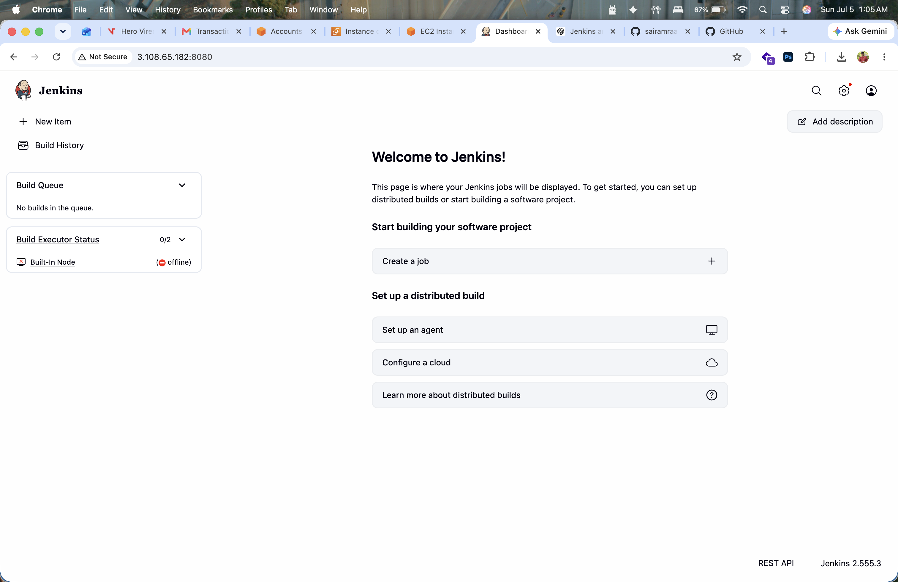

### Plugins installed
Git, GitHub, Pipeline, SSH Agent, Credentials Binding, Email Extension, Workspace Cleanup,
Blue Ocean.

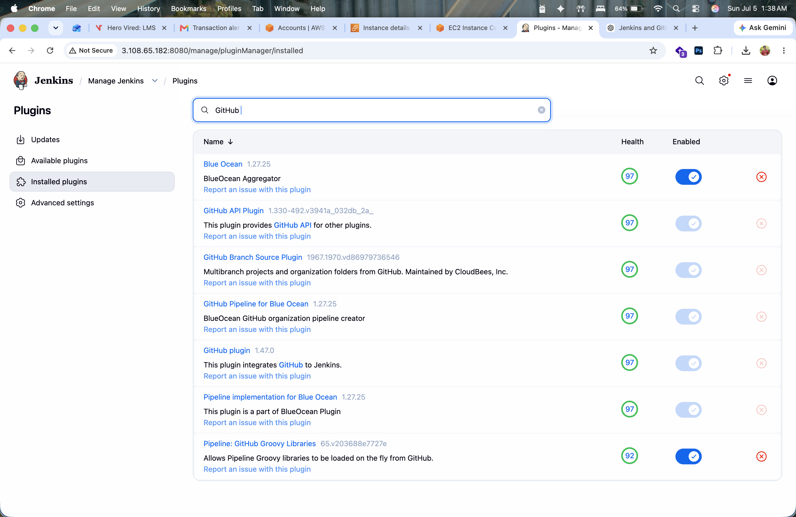

### Credentials created

| ID | Type | Purpose |
|---|---|---|
| `github-creds` | Personal Access Token | Checkout from GitHub |
| `flask-server` | SSH Username with private key | Deploy to the Flask EC2 host |
| `mongo-uri` | Secret text | Injects the MongoDB Atlas connection string into `.env` at deploy time |

GitHub password authentication is deprecated, so a **fine-grained Personal Access Token**
was generated (Contents: Read & write, Metadata: Read-only) and used for `github-creds`.

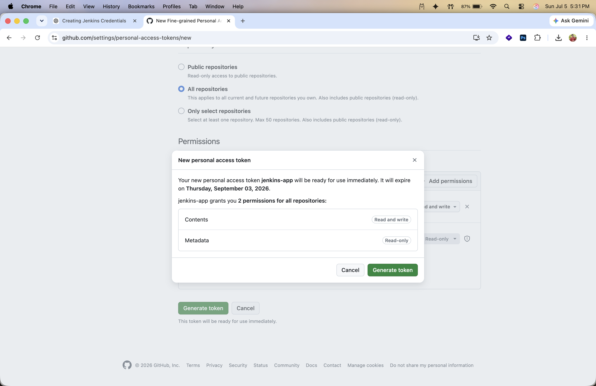
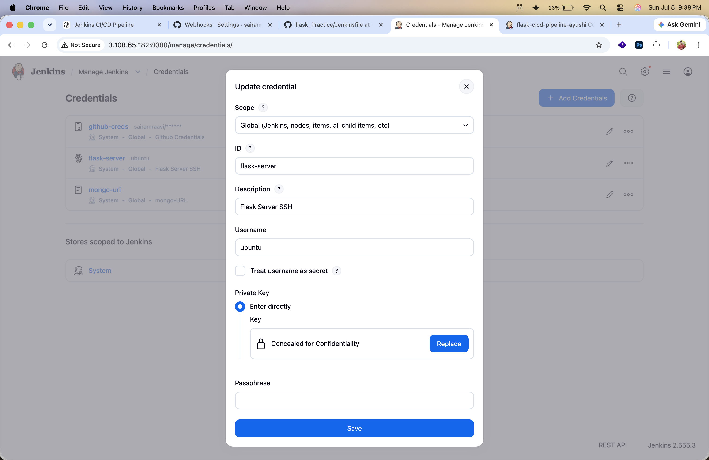

### GitHub Webhook
- Payload URL: `http://<JENKINS-PUBLIC-IP>:8080/github-webhook/`
- Content type: `application/json`
- Event: `push`

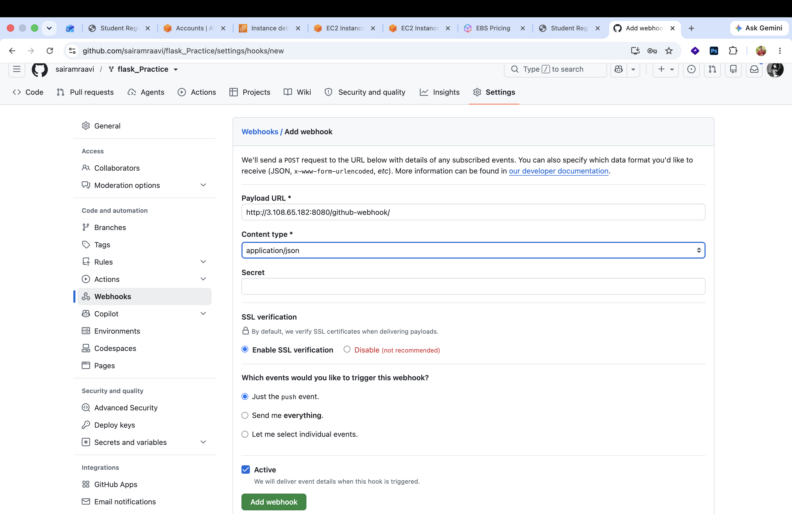

### SMTP (email notifications)
- Server: `smtp.gmail.com`, Port `587`, TLS enabled
- A Gmail **App Password** was used (regular password is blocked by Google for SMTP)
- Notifications are sent to the developer's email on both success and failure

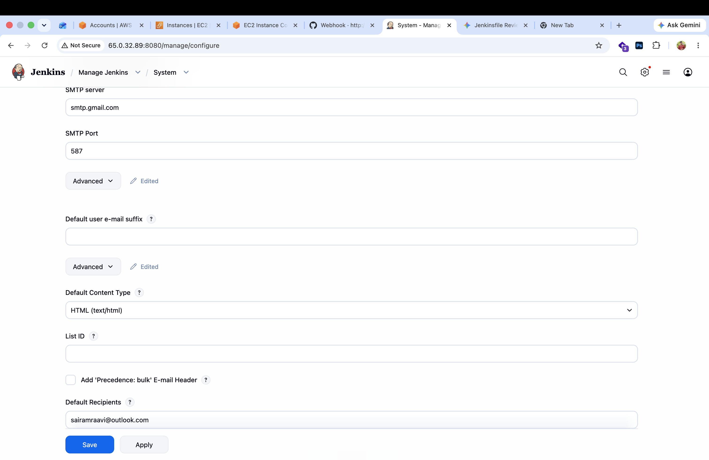

---

## Pipeline Stages

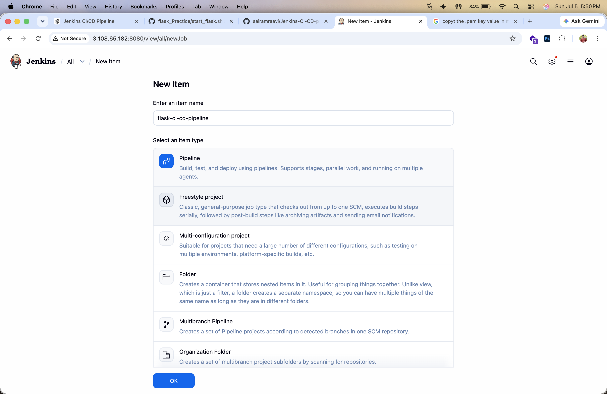

The final, stable pipeline (`Jenkinsfile`) runs the following stages:

```
Checkout SCM → Checkout Source → Build → Unit Test → Deploy to Flask Server → Health Check → Post Actions
```

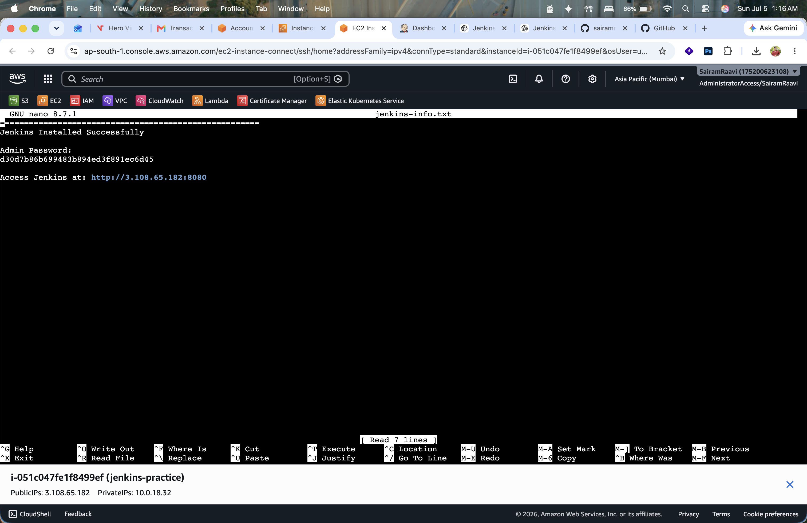

- **Build** — creates a virtual environment and installs `requirements.txt`

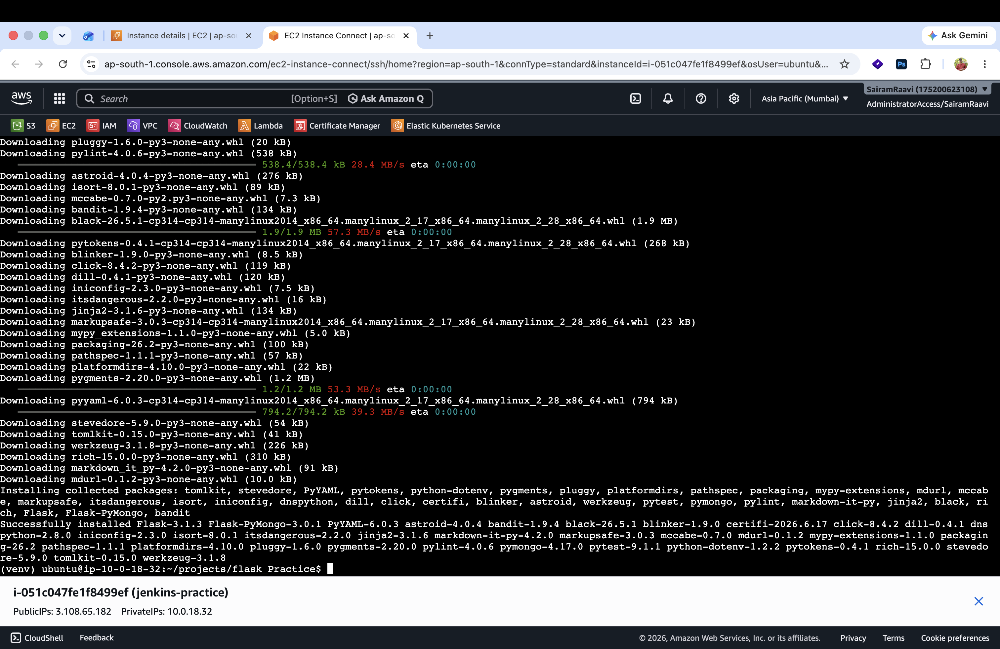

- **Unit Test** — runs `pytest` against `test_app.py`
- **Deploy to Flask Server** — uses the `sshagent` plugin with the `flask-server`
  credential to `scp` a freshly generated `.env` file and run a remote script that pulls
  the latest code, reinstalls dependencies, and restarts the `flask-app` systemd service
- **Health Check** — `curl`-checks the deployed app before marking the build successful
- **Post Actions** — cleans up the workspace and sends an email via Extended Email

An earlier, more ambitious version of the pipeline also included **Code Formatting**
(`black`), **Lint** (`pylint`), and a **Security Scan** (`bandit`) stage. These were kept
in early iterations but were made non-blocking (`bandit || true`) or removed later, since
they occasionally hung or failed for reasons unrelated to the core CI/CD objective, and
the assignment priority was a fully working, reliable deploy pipeline end to end.

---

## Challenges Faced and How They Were Resolved

This project had a lot of trial and error before it worked reliably. Below is an honest
record of the real issues hit along the way — this is a fair amount of the actual learning
from the assignment.

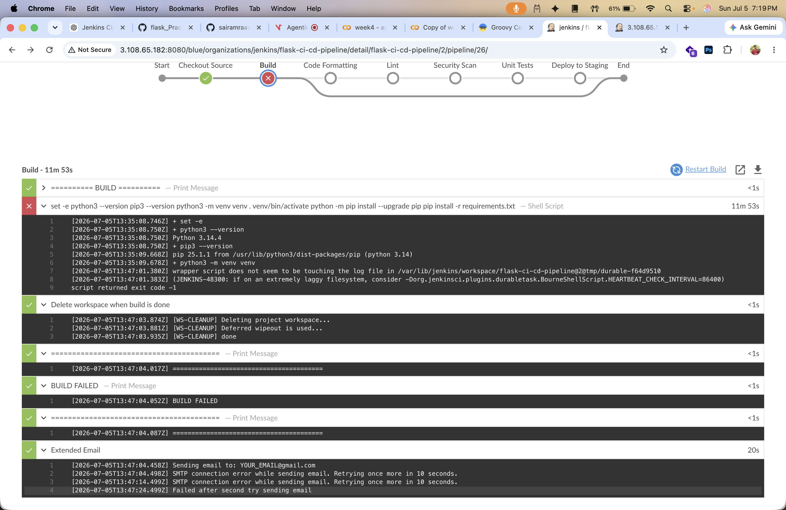
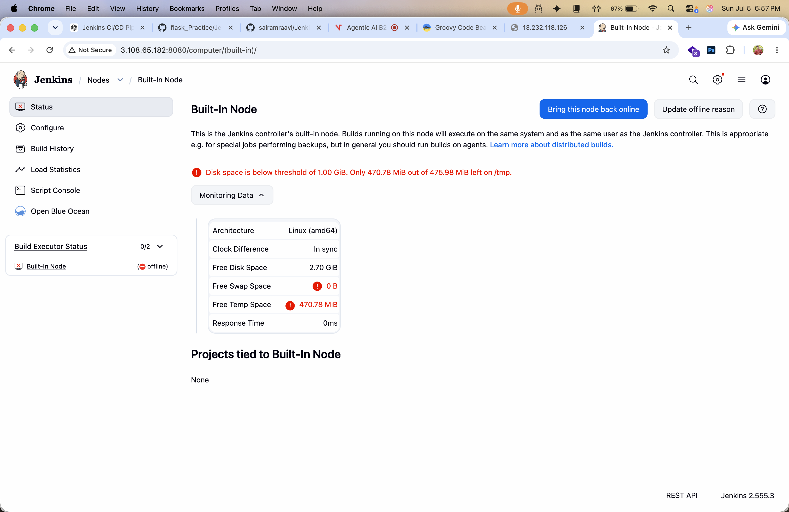

| Challenge | Root Cause | Resolution |
|---|---|---|
| Jenkins installation friction | Manual, repetitive setup | Automated with a Launch Template (`jenkins-userdata.sh`) |
| Flask server setup friction | Manual installation each time | Automated with a Launch Template (`flask-userdata.sh`) |
| GitHub authentication failing | GitHub removed password auth for Git operations | Switched to a fine-grained Personal Access Token |
| SSH "Permission denied" to Flask server | Public key not present in `authorized_keys` | Correctly added the Jenkins SSH public key to the Flask host |
| `git pull` failing during deploy | Credential/remote configuration issue | Fixed Git remote and SSH credential binding |
| `pip install` failing with "externally-managed-environment" | Ubuntu/Python 3.14's PEP 668 protection blocks global pip installs | Used a Python virtual environment (`venv`) for all installs |
| Build stage timing out / `venv` creation stalling | Slow filesystem / long-running shell step under Jenkins durable task wrapper | Simplified the build steps and increased visibility with heartbeat logging |
| `black` formatting check failing the build | Source code didn't match `black`'s formatting rules | Reformatted the codebase with `black` |
| `pylint` stage hanging | Environment/runtime issue in the Jenkins agent | Removed from the pipeline to keep deployment reliable for the assignment |
| `pytest` stage hanging | Test suite trying to reach a real MongoDB connection | Generated a working `.env` dynamically inside the pipeline before running tests |
| SMTP email failing ("SMTP connection error") | Gmail blocks basic password auth for SMTP | Generated and used a Gmail App Password |
| GitHub Webhook not triggering builds | Incorrect payload URL | Corrected the webhook URL to `http://<ip>:8080/github-webhook/` |
| Jenkins node going offline mid-build | Disk space below threshold on `/tmp` | Freed disk space / monitored via the Jenkins node status page |
| SSH deployment failing intermittently | SSH credential mismatch in Jenkins | Regenerated and correctly bound the `flask-server` SSH credential |

---

## Deployment Verification

After a successful pipeline run:
- Jenkins Blue Ocean shows all stages green (`Checkout → Build → Unit Test → Deploy → Health Check → Post Actions`)

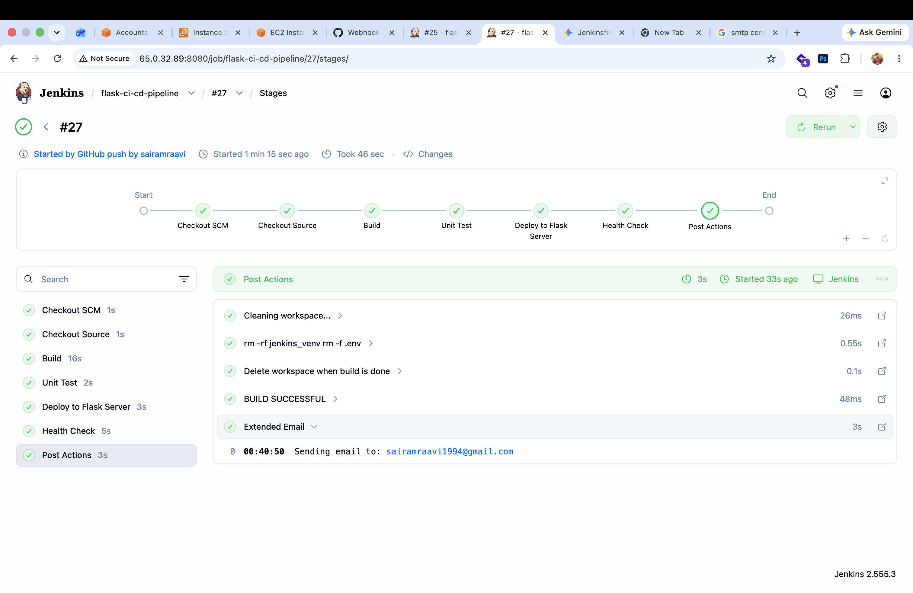

- `systemctl status flask-app` and `systemctl status nginx` show both services active on the Flask EC2 host

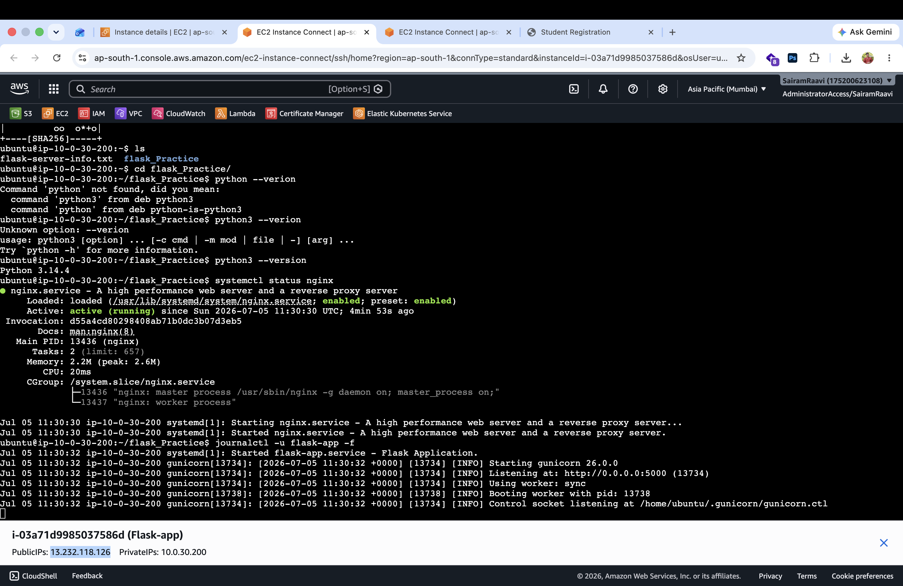

- The Jenkins server/node itself is healthy and ready to pick up builds

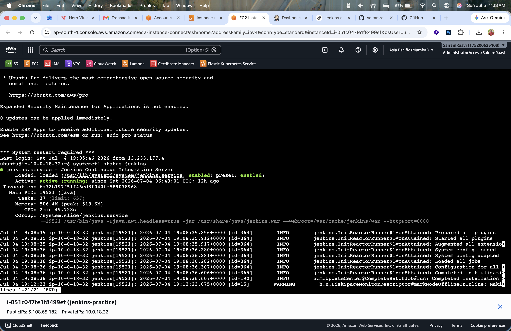

- The application (a Student Registration System built with Flask + MongoDB) is reachable at `http://<FLASK-PUBLIC-IP>`
- A build success/failure email is received at the configured recipient address

---

## Skills Demonstrated

- AWS EC2, Security Groups, and Launch Templates
- Linux server administration (Ubuntu)
- Jenkins installation, configuration, and declarative pipelines
- GitHub integration: Personal Access Tokens and Webhooks
- Jenkins credentials management (SSH keys, secret text, PATs)
- Python virtual environments and dependency management
- Flask application deployment with Gunicorn and systemd
- Nginx reverse proxy configuration
- MongoDB Atlas integration
- SMTP email notifications from Jenkins
- CI/CD pipeline design and debugging in a real (not idealized) environment

---

## Final Outcome

This project goes beyond a basic Jenkins exercise — it's a working, end-to-end CI/CD
pipeline built with industry-standard tools, including all the real troubleshooting that
comes with it: automating server provisioning, securing Jenkins with credentials and
plugins, integrating GitHub via tokens and webhooks, deploying over SSH, managing
configuration through environment variables, and resolving issues with Python
environments, testing, formatting, SMTP, and SSH along the way.
